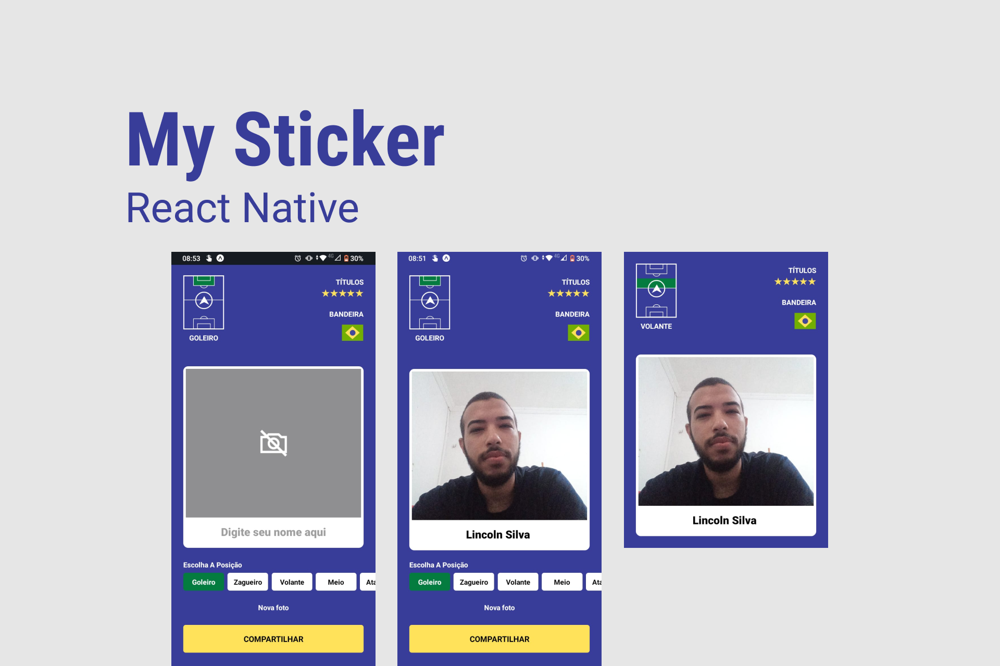

  <h1>My Sticker</h1>

  <a href="#-tecnologias">Tecnologias</a>
  &nbsp;&nbsp;&nbsp;|&nbsp;&nbsp;&nbsp;
  <a href="#-projeto">Projeto</a>
  &nbsp;&nbsp;&nbsp;|&nbsp;&nbsp;&nbsp;
  <a href="#-instalacao">Instalação</a>

 

  

## 🚀 Tecnologias

Esse projeto foi desenvolvido com as seguintes tecnologias:

- Typescript
- Expo
- React Native
- Expo camera
- Expo sharing
- React native view shot

## 💻 Projeto

O My Sticker é uma aplicação proposta pela Rocketseat que tem como objetivo gerar a nossa versão da figurinha da copa, criada a qualquer momento apenas com selfies e com o recurso de compartilhamento.

## Instalação

- Você precisa do nodejs e do expo-cli na sua máquina
- Clone o repositório do git
- Instale as dependências com yarn dentro do diretório
- E execute expo start

## Demo do aplicativo

- Instale o expo go no seu celular e leia o QRCode

---

Feito com ♥ by Lincoln silva

- [Instagram](https://www.instagram.com/jotalincoln/)
- [Github](https://github.com/LincolnSA)
- [Portfólio](https://lincolnsa.github.io/portfolio/)
- [devlincolnsilva@gmail.com](mailto:devlincolnsilva@gmail.com?subject=Oi%20lincoln)
